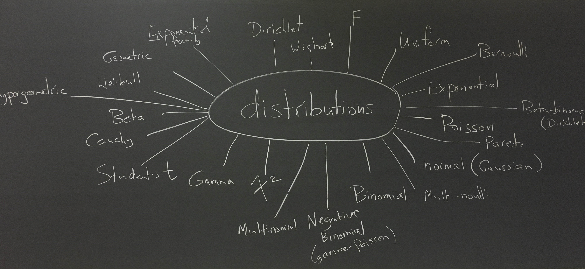
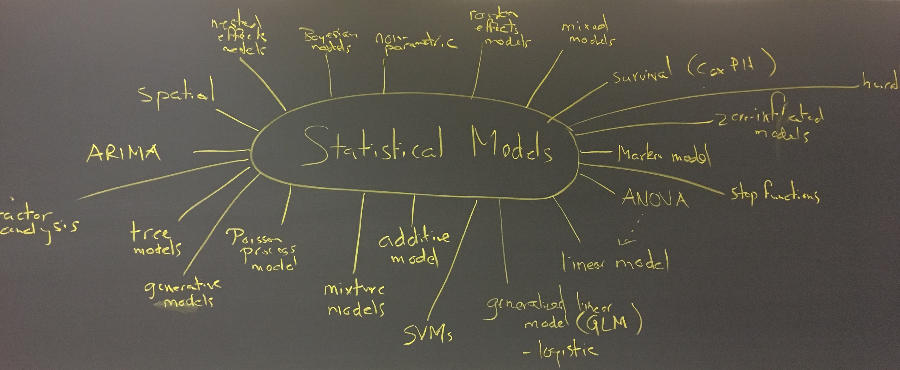
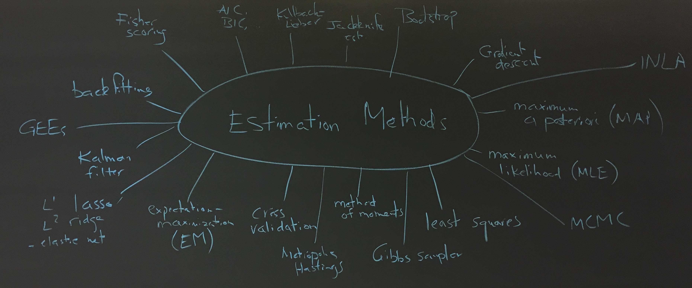
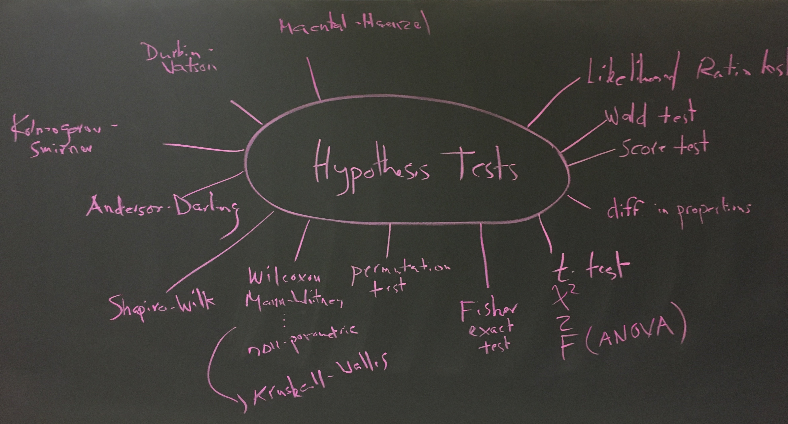
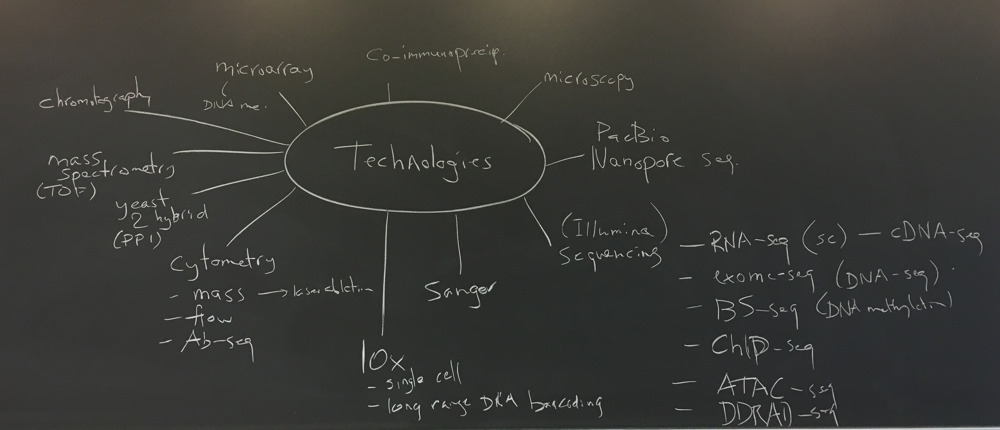
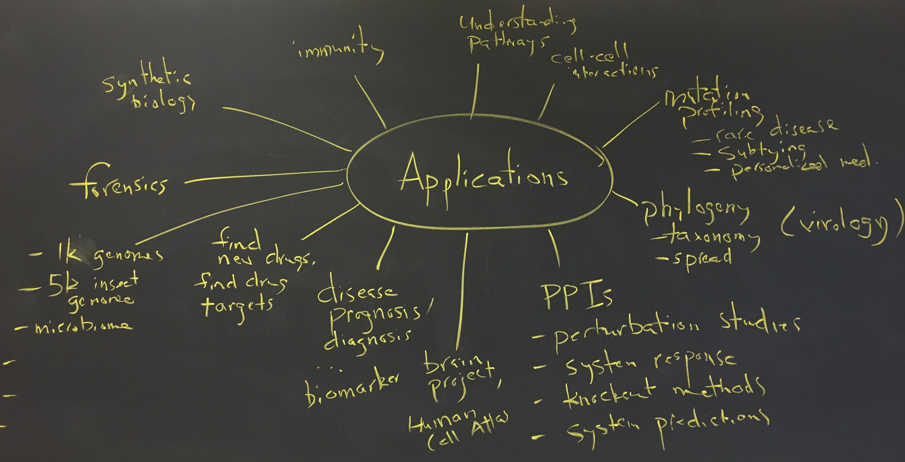
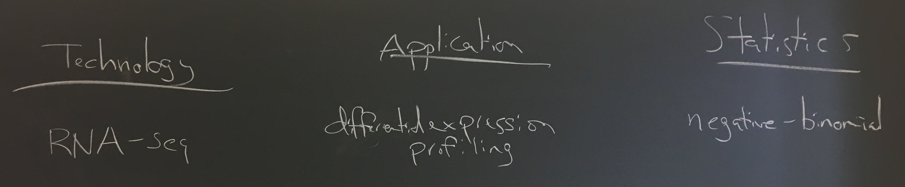

# Part 1 - Brainstorm: Statistics

## Distributions


## Statistical Models


## Methods for Estimation


## Methods for Hypothesis Testing



# Part 2 - Brainstorm: Technologies in Biology


```{r}
techs <- c("microarray", "rna-seq", "dna-seq", 
           "bisulphite-seq", "cytometry", "mass-spec", 
           "10x-chromium", "oxford-nanopore")

s <- sample(length(techs))
data.frame(row=s, techs)
```

___
## Exercise 2 part a (as a group)
#### produce a 2-3 point summary of "how it works"
#### links to a few (<5) good resources
#### create a markdown file for your description and make it your README.md in the "group assignment" repo
#### (choose how to share the work in your group)
___

# Part 3 - Brainstorm: Applications in genomics 


# Part 4 - Brainstorm: Linking Technologies to Applications to Statistics


#### e.g., microarray -> gene expression -> normally distributed (log intensities)

# Part 5 - Pick a *Technology*/*Application* from [*Seq](https://liorpachter.wordpress.com/seq/) and ..

___
## Exercise 2 part b (in same groups): 
#### write ~2 sentences about what the method does
#### make the link (technology -> application -> statistics)
#### create a markdown file (name it with the selected technology) with the description
#### fork the [material](https://github.com/sta426hs2019/material) repo
#### add your markdown file to the `week02-23sep2019` directory of the fork
#### send a pull request to the master repo of `material`
#### (list the github usernames of everyone in your group)
___

