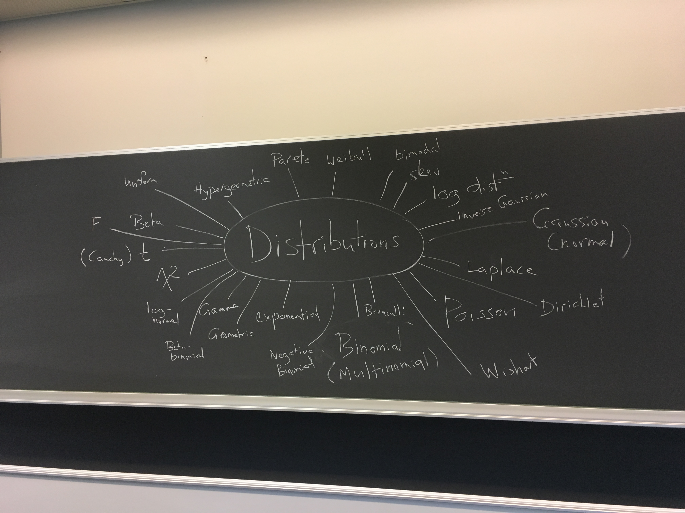
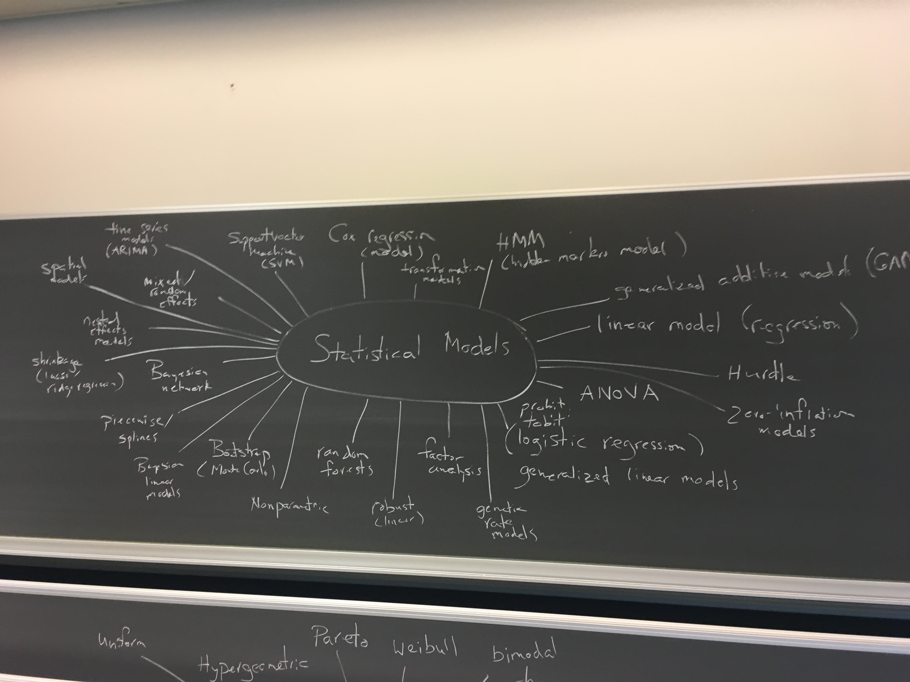
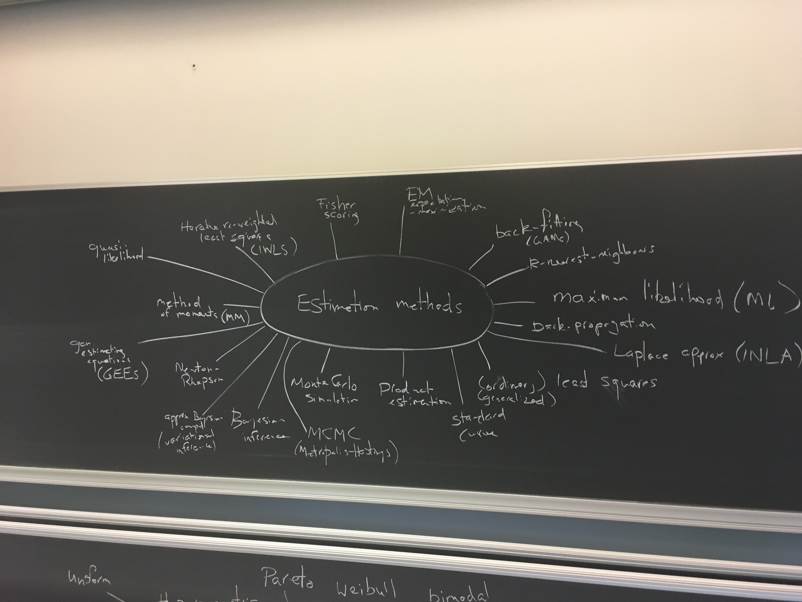
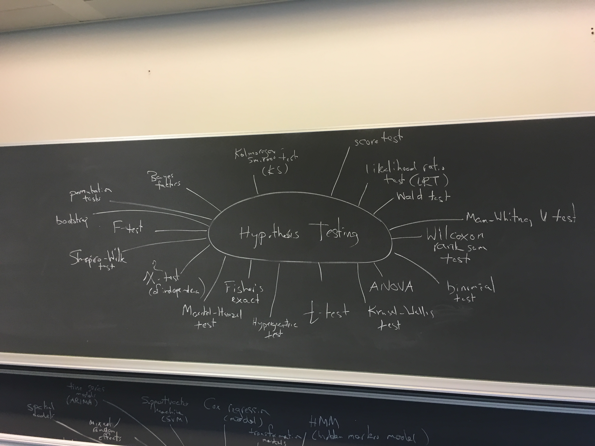
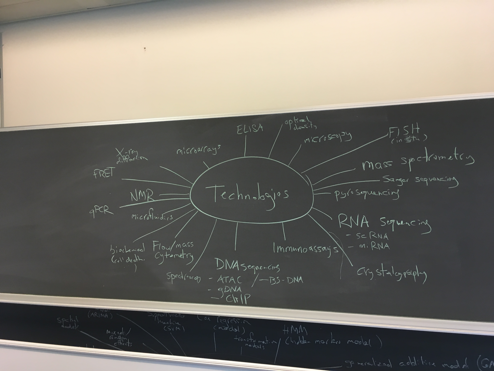
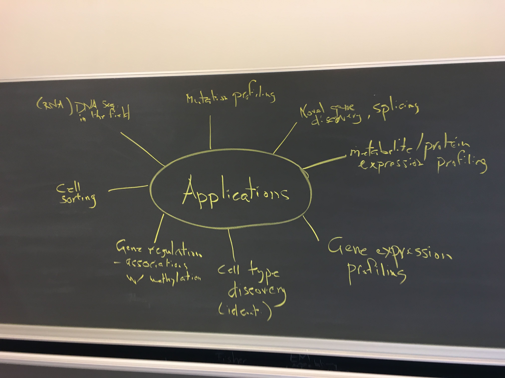

# Part 1 - Brainstorm: Statistics

## Distributions

 

## Statistical Models

 

## Methods for Estimation

 

## Methods for Hypothesis Testing

 

# Part 2 - Brainstorm: Technologies in Biology

 

## Microarray
## ...

## In-class exercise 1 (15 minutes)

### Technologies: 

```{r}
techs <- c("microarray", "rna-seq", "dna-seq", 
           "bisulphite-seq", "cytometry", "mass-spec", 
           "10x-chromium", "oxford-nanopore")

s <- sample(length(techs))
data.frame(row=s, techs)
```

### Task: 
#### produce a 2-3 point summary of "how it works"
#### links to a few (<5) good resources
#### create a markdown file for it and upload to README.me in "group assignment" repo

# Part 3 - Brainstorm: Applications in genomics 

 

# Part 4 - Brainstorm: Linking Technologies to Applications to Statistics

## e.g., microarray -> gene expression -> normally distributed (log intensities)

# Part 5 - Brainstorm: Methods/algorithms in genomics associated to Computer Science

# Part 6 - Pick a "technology" (from above, from [1] or otherwise) to briefly describe

## Exercise 2 (in groups of 1-3): 
### Goal: 
#### write ~2 sentences about what the method does
#### again, make the link (technology -> application -> statistics)
#### list the github usernames of everyone in your group
#### submit a pull request to brainstorm_modified.md

[1] [https://liorpachter.wordpress.com/seq/](https://liorpachter.wordpress.com/seq/)


